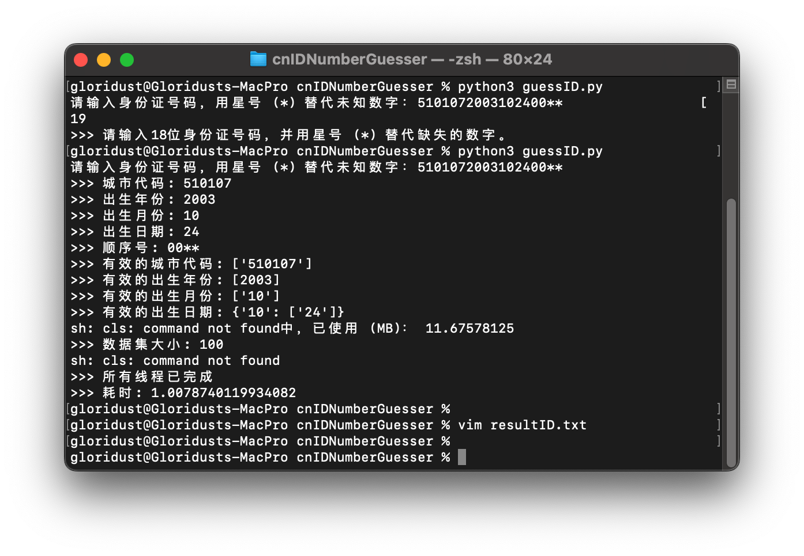
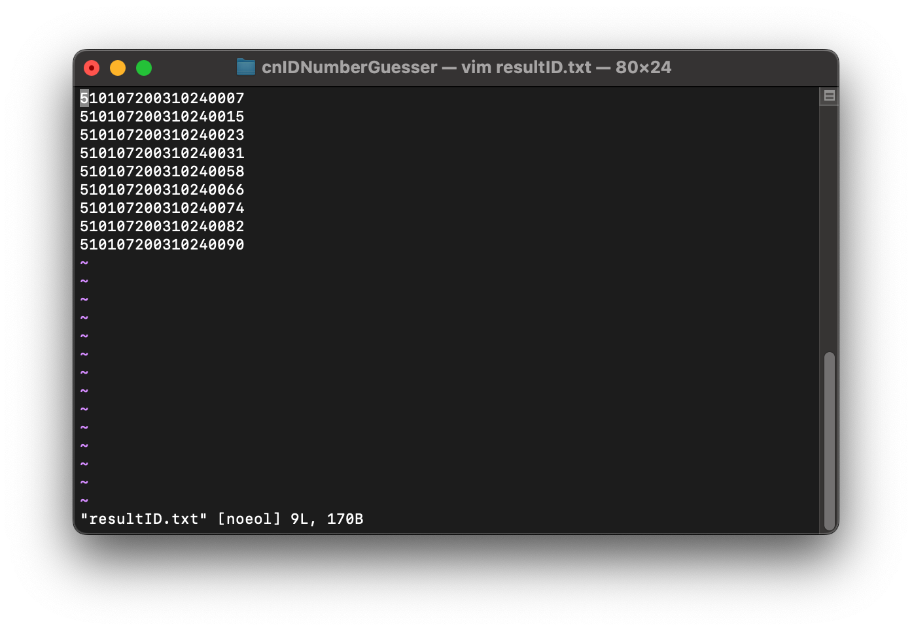
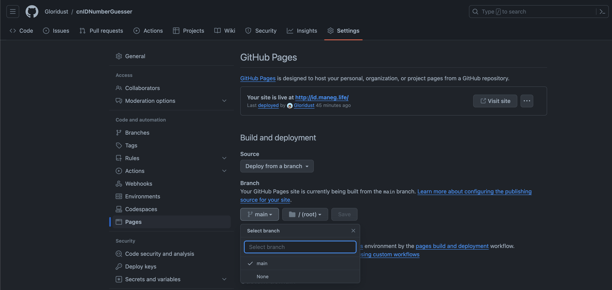
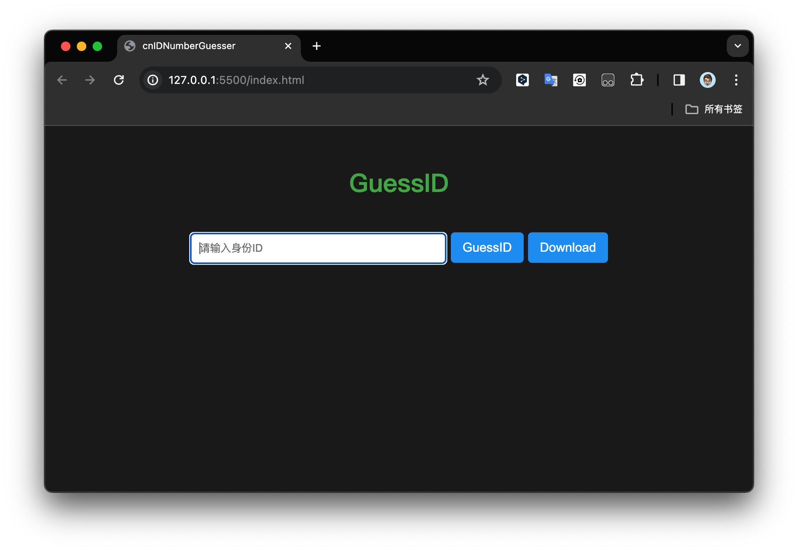
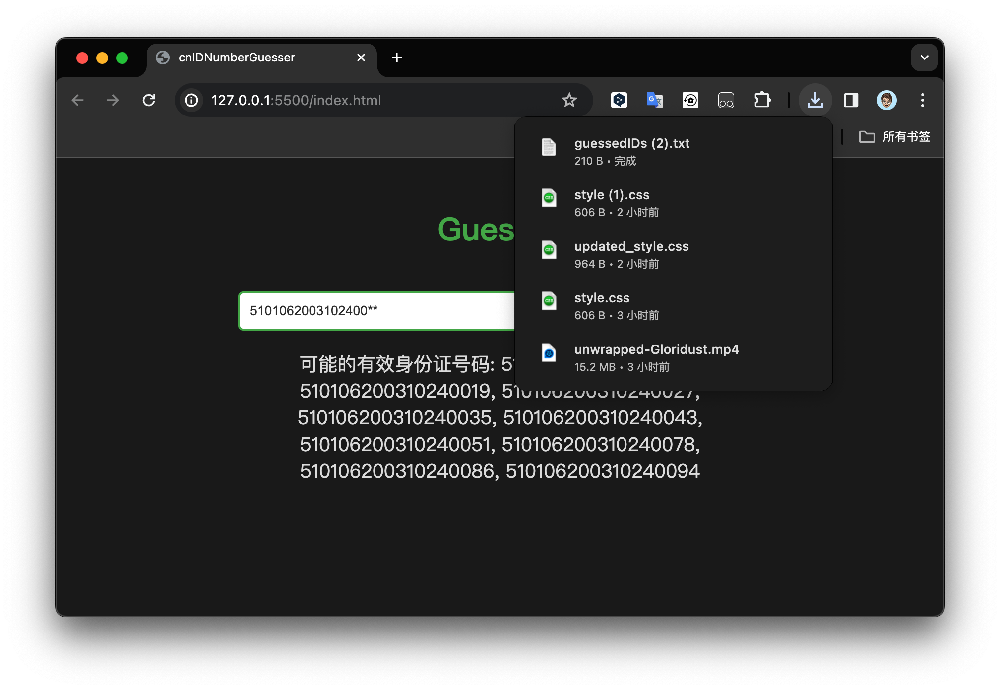

# cnIDNumberGuesser


  


  

此文档的语言为简体中文，仅针对中文用户。For English? [Please click here](https://github.com/Gloridust/cnIDNumberGuesser/README_en.md).

## 简介

这是一个用于推测并补全中国大陆身份证号码的项目，在您不记得身份证号的某一部分或者证件号码某一部分缺失时，可以用该工具补全身份证号码。该工具提供 Python 和 Web 两个版本，你可以选择在本地用 Python 运行，或者部署在服务器上通过前端 JS 代码实现。注意：该项目仅用于学术研究目的。**请遵守当地法律，不要用于非法用途。若不甚误入歧途，一切后果与作者无关**

## 部署和使用

### Python

1. 下载[guessID.py](guessID.py)和[citycodes.txt](citycodes.txt)并放在同一个文件夹中。您也可以把仓库全部下载下来：

```bash
git clone https://github.com/Gloridust/cnIDNumberGuesser
cd cnIDNumberGuesser
```

2. 安装依赖库

```python
pip install psutil
```

请确保您使用的是与您的 Python 版本兼容的 pip 版本。如果您在多个 Python 环境中工作，可能需要使用 `pip3` 代替 `pip`，或者使用特定于环境的命令，如 `python -m pip install`。

3. 运行程序代码：

```python
python3 guessID.py
```

4. 使用：输入 18 位身份证号码，待补全项用星号"*"代替



5. 程序结束后，在[resultID.txt](resultID.txt)查看结果。再次使用时，请删除原[resultID.txt](resultID.txt)文件。



### Web

0. 在 Web 部署，你可以直接[Fork 本项目](https://github.com/Gloridust/cnIDNumberGuesser/fork)，然后在 Github Page 选择分支并绑定域名，即可直接使用。



1. 如果你想部署在自己的服务器上，你需要下载[index.html](index.html),[script.js](script.js),[style.css](style.css),以及[citycodes.txt](citycodes.txt)并放在同一个文件夹中。 同样您也可以选择把仓库全部下载下来：

```bash
git clone https://github.com/Gloridust/cnIDNumberGuesser
cd cnIDNumberGuesser
```

2. 部署完成后，访问[index.html](index.html)即可开始使用。同样地，输入 18 位身份证号码，待补全项用星号"*"代替。



3. 点击“GuessID”运行。得出结果后，结果会显示在下方。你也可以点击“Download”将结果保存在 'guessedIDs.txt' 并下载到本地。



## 隐私说明

我们充分尊重用户的隐私。无论是 Python 还是 Web 版本，所有的数据均在用户端本地处理，不上传任何数据。

同样，我们希望使用者尊重他人隐私，不用与非法用途；**请遵守当地法律，不要用于非法用途。若不甚误入歧途，一切后果与作者无关。**

## 鸣谢

本项目的 Python 版本和 [citycodes.txt](citycodes.txt) 文件参考了[https://github.com/wlkjyh/completion_idcard](https://github.com/wlkjyh/completion_idcard)的内容。十分感谢作者的开源！

## 开源协议

MIT
